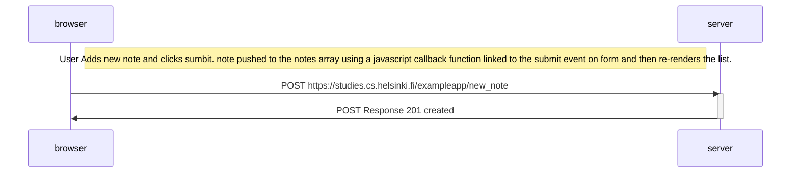

```mermaid
sequenceDiagram
participant browser
participant server
Note right of browser: User Adds new note and clicks sumbit. note pushed to the notes array using a javascript callback function linked to the submit event on form and then re-renders the list.
browser->>server: POST https://studies.cs.helsinki.fi/exampleapp/new_note
activate server
server->>browser: POST Response 201 created
deactivate server
```
