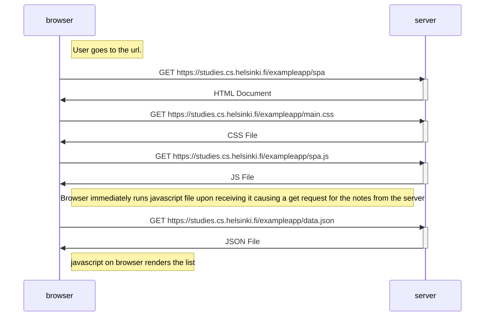

```mermaid
sequenceDiagram
participant browser
participant server
Note right of browser: User goes to the url.
browser->>server: GET https://studies.cs.helsinki.fi/exampleapp/spa
activate server
server->>browser: HTML Document
deactivate server
browser->>server: GET https://studies.cs.helsinki.fi/exampleapp/main.css
activate server
server->>browser: CSS File
deactivate server
browser->>server: GET https://studies.cs.helsinki.fi/exampleapp/spa.js
activate server 
server->>browser: JS File 
deactivate server
Note right of browser: Browser immediately runs javascript file upon receiving it causing a get request for the notes from the server
browser->>server: GET https://studies.cs.helsinki.fi/exampleapp/data.json
activate server
server->>browser: JSON File
deactivate server
Note right of browser: javascript on browser renders the list
```
